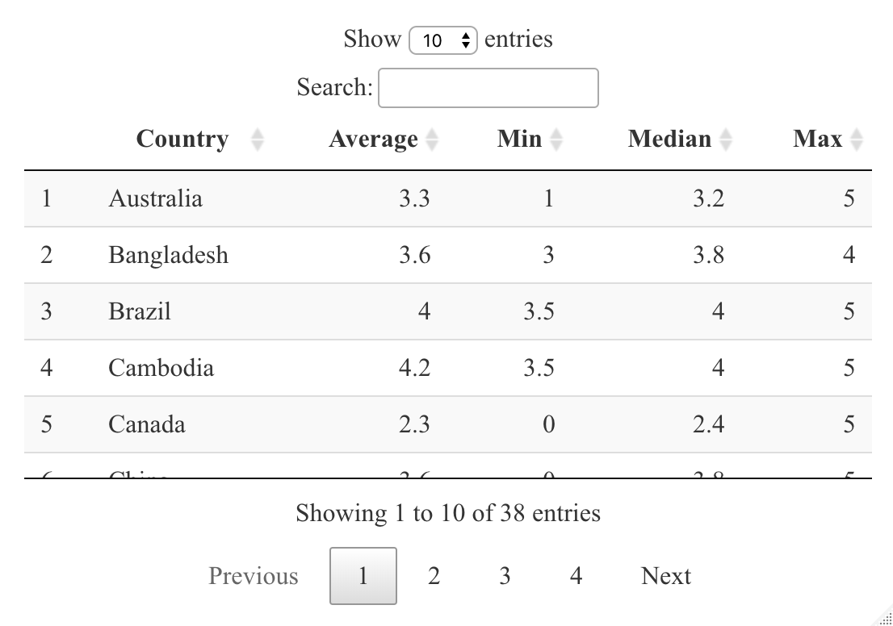
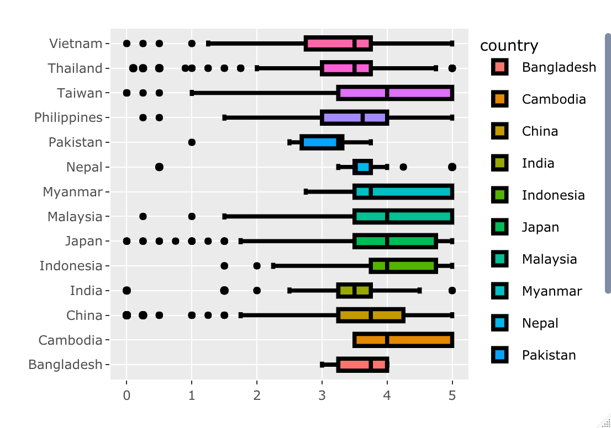
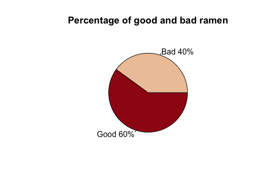
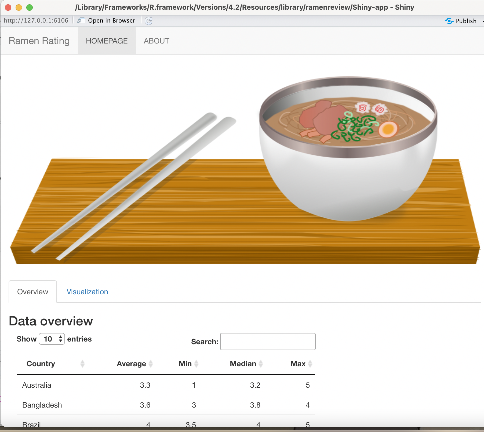

# ramenreview

## Purpose

The goal of **ramenreview** package is to provide information about different varieties of ramen from all over the world. The package also gives food lovers, especially ramen enthusiasts, some ideas of the best ramen in the world. 

More detailed information about the package can be found [here](https://etc5523-2022.github.io/rpkg-PhuongThanhTrinh/).

## Installation

You can install the development version of ramenreview from [GitHub](https://github.com/) with:

```{r, eval=FALSE}
# install.packages("devtools")
devtools::install_github("etc5523-2022/rpkg-PhuongThanhTrinh")
```


## Example

Below is a guidline on how to use the **ramenreview** package:

1. Load the library
```{r}
library(ramenreview)
```

2. Exploring the functions

* `get_ramen_rating()`:	Get ramen_rating dataset

This function will return a tibble including 3180 rows and 6 columns, as shown below:
``` {r}
get_ramen_rating()
```

* `get_table()`:	Get ramen_rating dataset in tabular format

This function will return a tidy formatted table comprising 4 summary statistics for ramen from different countries.

```{r, eval=FALSE}
get_table()
```



* `get_average()`: Get the average ratings

This function will produce boxplot showing averaging ratings on each country, across continents. By passing the argument "continents", the plot will in turn filter the plot according to the continents chosen. For example,`get_average(continents = "Asia")` will return result like below:

```{r, eval=FALSE}
# generate plot showing five summary values for countries located in Asia
get_average(continents = "Asia")
```




* `get_pct()`	Get good and bad ramen from each country

This function will generate a plot showing the associated proportion of good and bad ramen for each nation.

```{r, eval=FALSE}
get_pct(names = "Australia")
```



* `get_best_style()`:	Get highest varieties

This function will return a description of the number of ramen variations available in one style. Example is shown as follow:

```{r} 
# get the total number of ramen varieties in Bowl style
get_best_style(styles = "Bowl")
```

* `get_rank()`:	Rank highest average rate

This function will help to compute the ranking of average rate for each ramen style.


```{r}
# Get rank of ramen in Cup style
get_rank(styles = "Cup")
```


* `run_app()`:	Get shiny app for ramen rating dataset


