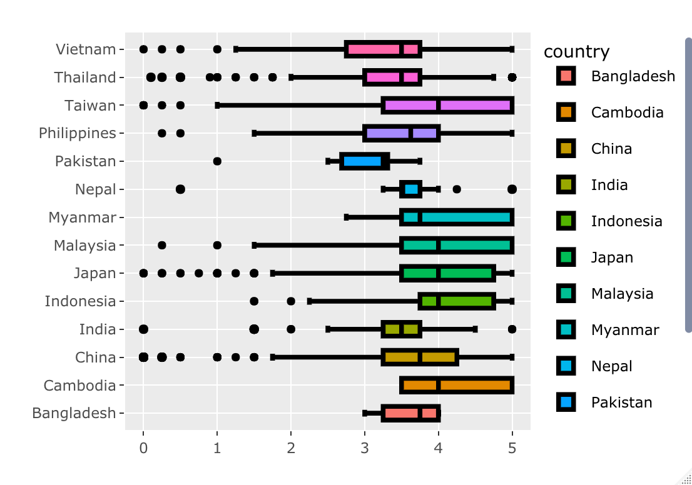
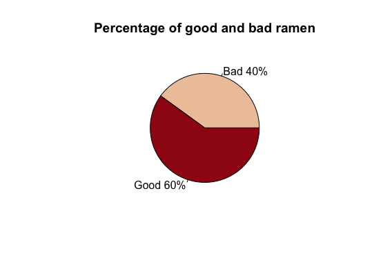
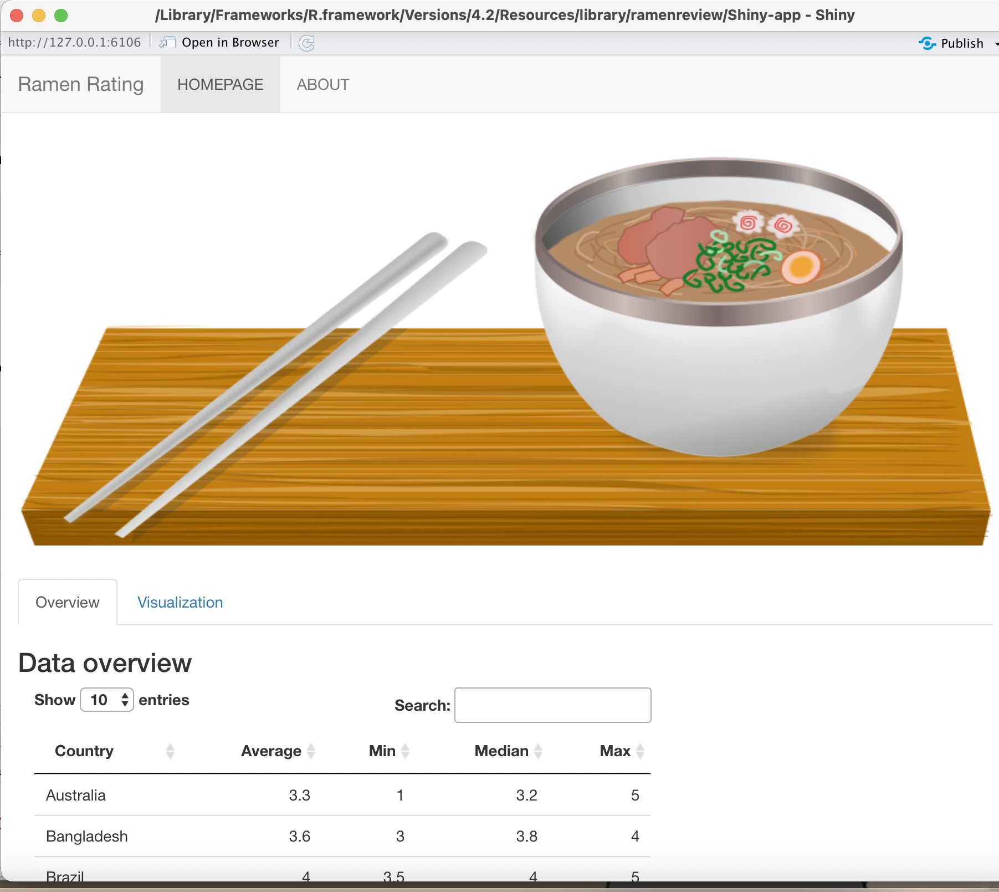

# ramenreview

## Purpose

The goal of **ramenreview** package is to provide information about
different varieties of ramen from all over the world. The package also
gives food lovers, especially ramen enthusiasts, some ideas of the best
ramen in the world.

More detailed information about the package can be found
[here](https://etc5523-2022.github.io/rpkg-PhuongThanhTrinh/).

## Installation

You can install the development version of ramenreview from
[GitHub](https://github.com/) with:

``` r
# install.packages("devtools")
devtools::install_github("etc5523-2022/rpkg-PhuongThanhTrinh")
```

## Example

Below is a guidline on how to use the **ramenreview** package:

1.  Load the library

``` r
library(ramenreview)
```

2.  Exploring the functions

-   `get_ramen_rating()`: Get ramen_rating dataset

This function will return a tibble including 3180 rows and 6 columns, as
shown below:

``` r
get_ramen_rating()
```

    ## Rows: 3180 Columns: 6
    ## ── Column specification ────────────────────────────────────────────────────────
    ## Delimiter: ","
    ## chr (4): brand, variety, style, country
    ## dbl (2): review_number, stars
    ## 
    ## ℹ Use `spec()` to retrieve the full column specification for this data.
    ## ℹ Specify the column types or set `show_col_types = FALSE` to quiet this message.

    ## # A tibble: 3,180 × 7
    ##    review_number brand           variety             style country stars conti…¹
    ##            <dbl> <chr>           <chr>               <chr> <chr>   <dbl> <chr>  
    ##  1          3180 Yum Yum         Tem Tem Tom Yum Mo… Cup   Thaila…  3.75 Asia   
    ##  2          3179 Nagatanien      tom Yum Kung Rice … Pack  Japan    2    Asia   
    ##  3          3178 Acecook         Kelp Broth Shio Ra… Cup   Japan    2.5  Asia   
    ##  4          3177 Maison de Coree Ramen Gout Coco Po… Cup   France   3.75 Europe 
    ##  5          3176 Maruchan        Gotsumori Shio Yak… Tray  Japan    5    Asia   
    ##  6          3175 Myojo           Chukazanmai Tantan… Cup   Japan    3.5  Asia   
    ##  7          3174 TIEasy          Sesame Sauce Handm… Pack  Taiwan   3.75 Asia   
    ##  8          3173 Sapporo Ichiban Momosan Ramen Tonk… Pack  United…  5    America
    ##  9          3172 Samlip          Hi-Myon Katsuo Udon Pack  Republ…  3.5  <NA>   
    ## 10          3171 Doll            Bowl Noodle Satay … Bowl  China    4.25 Asia   
    ## # … with 3,170 more rows, and abbreviated variable name ¹​continent

-   `get_table()`: Get ramen_rating dataset in tabular format

This function will return a tidy formatted table comprising 4 summary
statistics for ramen from different countries.

``` r
get_table()
```


-   `get_average()`: Get the average ratings

This function will produce boxplot showing averaging ratings on each
country, across continents. By passing the argument “continents”, the
plot will in turn filter the plot according to the continents chosen.
For example,`get_average(continents = "Asia")` will return result like
below:

``` r
# generate plot showing five summary values for countries located in Asia
get_average(continents = "Asia")
```



-   `get_pct()` Get good and bad ramen from each country

This function will generate a plot showing the associated proportion of
good and bad ramen for each nation.

``` r
get_pct(names = "Australia")
```



-   `get_best_style()`: Get highest varieties

This function will return a description of the number of ramen
variations available in one style. Example is shown as follow:

``` r
# get the total number of ramen varieties in Bowl style
get_best_style(styles = "Bowl")
```

    ## [1] "There are 612 variations available in this style!"

-   `get_rank()`: Rank highest average rate

This function will help to compute the ranking of average rate for each
ramen style.

``` r
# Get rank of ramen in Cup style
get_rank(styles = "Cup")
```

    ## [1] "This style ranks 8th among all styles!"

-   `run_app()`: Get shiny app for ramen rating dataset


